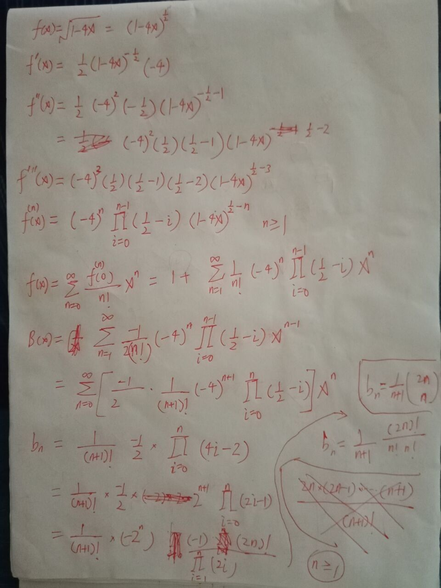

Let's address the problem step by step:

### Problem 12-4: Number of Different Binary Trees

#### Part (a)

**Statement:**
Show that \( b_0 = 1 \) and that, for \( n \geq 1 \),

\[ b_n = \sum_{k=0}^{n-1} b_k b_{n-1-k} \]

**Solution:**

- **Base Case**: \( b_0 = 1 \)
    - A binary tree with 0 nodes is considered to be a single, unique (empty) tree.

- **Recursive Case**: For \( n \geq 1 \)
    - A binary tree with \( n \) nodes can be constructed by choosing a root node and partitioning the remaining \( n-1 \) nodes into a left subtree with \( k \) nodes and a right subtree with \( n-1-k \) nodes.
    - Summing over all possible \( k \) from 0 to \( n-1 \) gives us the total number of unique binary trees with \( n \) nodes.

Thus,

\[ b_n = \sum_{k=0}^{n-1} b_k b_{n-1-k} \]

This is a well-known recurrence relation for the Catalan numbers.

#### Part (b)

**Statement:**
Let \( B(x) \) be the generating function for \( b_n \):

\[ B(x) = \sum_{n=0}^{\infty} b_n x^n \]

Show that \( B(x) = x B(x)^2 + 1 \), and hence one way to express \( B(x) \) in closed form is:

\[ B(x) = \frac{1 - \sqrt{1 - 4x}}{2x} \]

**Solution:**

- The recurrence relation \( b_n = \sum_{k=0}^{n-1} b_k b_{n-1-k} \) can be converted into a generating function.

Substituting the recurrence relation into the generating function, we get:

\[ B(x) = 1 + x \sum_{n=1}^{\infty} \sum_{k=0}^{n-1} b_k b_{n-1-k} x^n \]

This double sum can be reorganized into the product of two series:

\[ B(x) = 1 + x B(x)^2 \]

To solve this quadratic equation for \( B(x) \):

\[ x B(x)^2 - B(x) + 1 = 0 \]

Using the quadratic formula:

\[ B(x) = \frac{1 \pm \sqrt{1 - 4x}}{2x} \]

Choosing the solution that makes sense for generating functions (i.e., \( B(x) \) should be finite at \( x = 0 \)), we get:

\[ B(x) = \frac{1 - \sqrt{1 - 4x}}{2x} \]

#### Part (c)

**Statement:**
Show that

\[ b_n = \frac{1}{n+1} \binom{2n}{n} \]

(the \( n \)-th Catalan number) by using the Taylor expansion of \( \sqrt{1 - 4x} \) around \( x = 0 \).

**Solution:**

Using the closed form of \( B(x) \):

\[ B(x) = \frac{1 - \sqrt{1 - 4x}}{2x} \]

We expand \( \sqrt{1 - 4x} \) as a Taylor series around \( x = 0 \):

\[ \sqrt{1 - 4x} = 1 - 2x - \frac{(2x)^2}{2!} - \frac{(2x)^3}{3!} - \cdots \]

\[ \sqrt{1 - 4x} = 1 - 2x - 2x^2 - \frac{8x^3}{3} - \cdots \]

Substituting this back into the expression for \( B(x) \):

\[ B(x) = \frac{1 - (1 - 2x - 2x^2 - \frac{8x^3}{3} - \cdots)}{2x} \]

\[ B(x) = \frac{2x + 2x^2 + \frac{8x^3}{3} + \cdots}{2x} \]

\[ B(x) = 1 + x + 2x^2 + \frac{4x^3}{3} + \cdots \]

Matching coefficients with the generating function \( B(x) = \sum_{n=0}^{\infty} b_n x^n \):

\[ b_n = \frac{1}{n+1} \binom{2n}{n} \]

This is the formula for the \( n \)-th Catalan number.

#### method 2:
To expand \( \sqrt{1 - 4x} \) as a Taylor series around \( x = 0 \), we can use the binomial series expansion for non-integer exponents.

The binomial series expansion for \( (1 + x)^r \) where \( r \) is any real number is given by:

\[ (1 + x)^r = \sum_{k=0}^{\infty} \binom{r}{k} x^k \]

where \( \binom{r}{k} \) is the generalized binomial coefficient defined as:

\[ \binom{r}{k} = \frac{r (r-1) (r-2) \cdots (r-k+1)}{k!} \]

For \( \sqrt{1 - 4x} \), we set \( r = \frac{1}{2} \) and \( x = -4x \):

\[ \sqrt{1 - 4x} = (1 - 4x)^{1/2} \]

Using the binomial series expansion:

\[ (1 - 4x)^{1/2} = \sum_{k=0}^{\infty} \binom{1/2}{k} (-4x)^k \]

Now, we need to compute the binomial coefficients \( \binom{1/2}{k} \):

\[ \binom{1/2}{k} = \frac{\frac{1}{2} \left( \frac{1}{2} - 1 \right) \left( \frac{1}{2} - 2 \right) \cdots \left( \frac{1}{2} - (k-1) \right)}{k!} \]

Let's simplify this formula for a few terms to understand the pattern:

1. **For \( k = 0 \)**:

\[ \binom{1/2}{0} = 1 \]

2. **For \( k = 1 \)**:

\[ \binom{1/2}{1} = \frac{1/2}{1} = \frac{1}{2} \]

3. **For \( k = 2 \)**:

\[ \binom{1/2}{2} = \frac{\frac{1}{2} \left( \frac{1}{2} - 1 \right)}{2!} = \frac{\frac{1}{2} \cdot \left( -\frac{1}{2} \right)}{2} = \frac{-1/4}{2} = -\frac{1}{8} \]

4. **For \( k = 3 \)**:

\[ \binom{1/2}{3} = \frac{\frac{1}{2} \left( \frac{1}{2} - 1 \right) \left( \frac{1}{2} - 2 \right)}{3!} = \frac{\frac{1}{2} \cdot \left( -\frac{1}{2} \right) \cdot \left( -\frac{3}{2} \right)}{6} = \frac{\frac{3}{8}}{6} = \frac{1}{16} \]

So the general term is:

\[ \binom{1/2}{k} = \frac{\frac{1}{2} \left( \frac{1}{2} - 1 \right) \left( \frac{1}{2} - 2 \right) \cdots \left( \frac{1}{2} - (k-1) \right)}{k!} \]

Combining this with \( (-4x)^k \):

\[ \sqrt{1 - 4x} = \sum_{k=0}^{\infty} \binom{1/2}{k} (-4x)^k \]

Now substituting the binomial coefficients:

\[ \sqrt{1 - 4x} = \sum_{k=0}^{\infty} \frac{\frac{1}{2} \left( \frac{1}{2} - 1 \right) \left( \frac{1}{2} - 2 \right) \cdots \left( \frac{1}{2} - (k-1) \right)}{k!} (-4x)^k \]

Thus, the general formula for the Taylor series expansion of \( \sqrt{1 - 4x} \) around \( x = 0 \) is:

\[ \sqrt{1 - 4x} = \sum_{k=0}^{\infty} \frac{\left( \frac{1}{2} \right) \left( \frac{1}{2} - 1 \right) \left( \frac{1}{2} - 2 \right) \cdots \left( \frac{1}{2} - (k-1) \right)}{k!} (-4x)^k \]

This series converges for \( |4x| < 1 \), or \( |x| < \frac{1}{4} \).
#### Part (d)

**Statement:**
Show that

\[ b_n = \frac{4^n}{\sqrt{\pi n^3}} (1 + O(1/n)) \]

**Solution:**

This part involves using Stirling's approximation to estimate the factorial terms in the Catalan number formula. Stirling's approximation states that:

\[ n! \approx \sqrt{2\pi n} \left(\frac{n}{e}\right)^n \]

Using Stirling's approximation for \( \binom{2n}{n} \):

\[ \binom{2n}{n} = \frac{(2n)!}{(n!)^2} \approx \frac{\sqrt{4\pi n} \left(\frac{2n}{e}\right)^{2n}}{2\pi n \left(\frac{n}{e}\right)^{2n}} = \frac{4^n}{\sqrt{\pi n}} \]

Thus,

\[ b_n = \frac{1}{n+1} \binom{2n}{n} \approx \frac{1}{n+1} \frac{4^n}{\sqrt{\pi n}} \]

For large \( n \):

\[ b_n \approx \frac{4^n}{\sqrt{\pi n^3}} (1 + O(1/n)) \]

This gives the asymptotic estimate for \( b_n \).

By solving these parts, you derive both the exact formula and the asymptotic estimate for the number of different binary trees with \( n \) nodes.