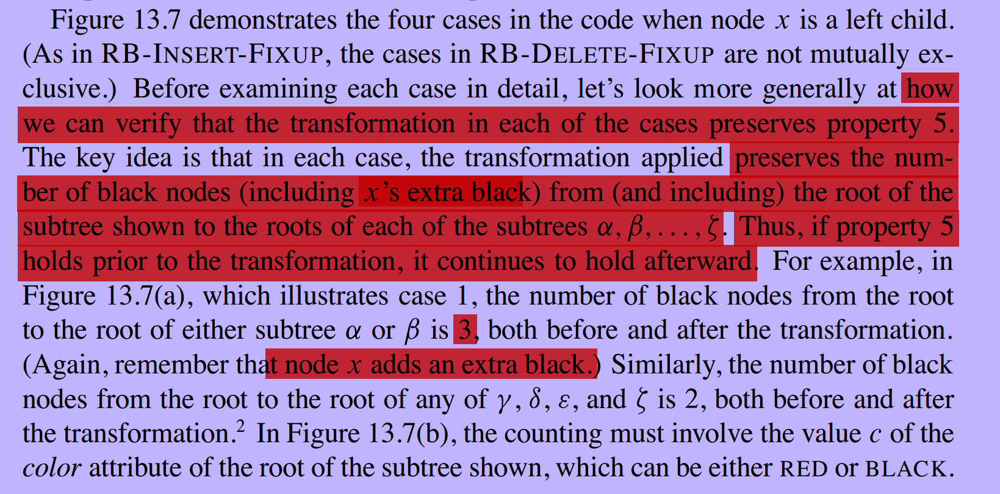

## In a tree structure, most of the time you need "indentity comparison"(A is B) instead of "equality comparison"(A == B)

---

## Attention: extremely important: how we can verify that the transformation in each of the cases preserves property 5

