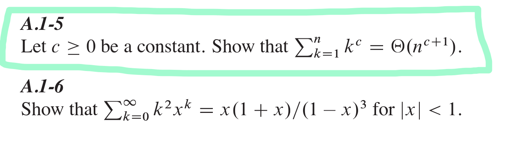

# A.1-5
To show that \(\sum_{k=1}^n k^c = \Theta(n^{c+1})\) for \(c \geq 0\), we need to establish both the upper and lower bounds for the sum.

### Step-by-Step Solution:

1. **Lower Bound:**
   - Consider the sum \(\sum_{k=1}^n k^c\).
   - For the lower bound, we can use the fact that \(k^c \geq (n/2)^c\) for \(k \geq n/2\).
   - Therefore, the sum can be bounded from below by:
     \[
     \sum_{k=\lceil n/2 \rceil}^n k^c \geq \sum_{k=\lceil n/2 \rceil}^n \left(\frac{n}{2}\right)^c = (n - \lceil n/2 \rceil + 1) \left(\frac{n}{2}\right)^c.
     \]
   - Simplifying the number of terms:
     \[
     n - \lceil n/2 \rceil + 1 \approx \frac{n}{2}.
     \]
   - Thus, the lower bound is:
     \[
     \sum_{k=\lceil n/2 \rceil}^n k^c \geq \frac{n}{2} \left(\frac{n}{2}\right)^c = \frac{n^{c+1}}{2^{c+1}}.
     \]

2. **Upper Bound:**
   - For the upper bound, we can use the fact that \(k^c \leq n^c\) for all \(k \leq n\).
   - Therefore, the sum can be bounded from above by:
     \[
     \sum_{k=1}^n k^c \leq \sum_{k=1}^n n^c = n \cdot n^c = n^{c+1}.
     \]

### Conclusion:
- The lower bound is \(\frac{n^{c+1}}{2^{c+1}}\).
- The upper bound is \(n^{c+1}\).

Since \(\frac{n^{c+1}}{2^{c+1}}\) and \(n^{c+1}\) are both \(\Theta(n^{c+1})\), we can conclude that:
\[
\sum_{k=1}^n k^c = \Theta(n^{c+1}).
\]

Thus, the sum \(\sum_{k=1}^n k^c\) is indeed \(\Theta(n^{c+1})\) for \(c \geq 0\).

---

# solution A.1-6:

To show that \(\sum_{k=0}^{\infty} k^2 x^k = \frac{x(1 + x)}{(1 - x)^3}\) for \(|x| < 1\), we can use some properties of power series and differentiation.

### Step-by-Step Solution:

1. **Start with the geometric series:**
   \[
   \sum_{k=0}^{\infty} x^k = \frac{1}{1 - x} \quad \text{for} \quad |x| < 1.
   \]

2. **Differentiate both sides with respect to \(x\):**
   \[
   \sum_{k=1}^{\infty} k x^{k-1} = \frac{1}{(1 - x)^2}.
   \]
   Multiplying both sides by \(x\):
   \[
   \sum_{k=1}^{\infty} k x^k = \frac{x}{(1 - x)^2}.
   \]

3. **Differentiate the result again with respect to \(x\):**
   \[
   \sum_{k=1}^{\infty} k^2 x^{k-1} = \frac{d}{dx} \left( \frac{x}{(1 - x)^2} \right).
   \]
   Using the quotient rule:
   \[
   \frac{d}{dx} \left( \frac{x}{(1 - x)^2} \right) = \frac{(1 - x)^2 \cdot 1 - x \cdot 2(1 - x)(-1)}{(1 - x)^4} = \frac{(1 - x)^2 + 2x(1 - x)}{(1 - x)^4} = \frac{1 - 2x + x^2 + 2x - 2x^2}{(1 - x)^4} = \frac{1 - x^2}{(1 - x)^4}.
   \]
   Simplifying further:
   \[
   \frac{1 - x^2}{(1 - x)^4} = \frac{(1 + x)(1 - x)}{(1 - x)^4} = \frac{1 + x}{(1 - x)^3}.
   \]

4. **Multiply both sides by \(x\):**
   \[
   \sum_{k=1}^{\infty} k^2 x^k = \frac{x(1 + x)}{(1 - x)^3}.
   \]

5. **Add the \(k=0\) term:**
   \[
   \sum_{k=0}^{\infty} k^2 x^k = 0 + \sum_{k=1}^{\infty} k^2 x^k = \frac{x(1 + x)}{(1 - x)^3}.
   \]

Thus, we have shown that:
\[
\sum_{k=0}^{\infty} k^2 x^k = \frac{x(1 + x)}{(1 - x)^3} \quad \text{for} \quad |x| < 1.
\]